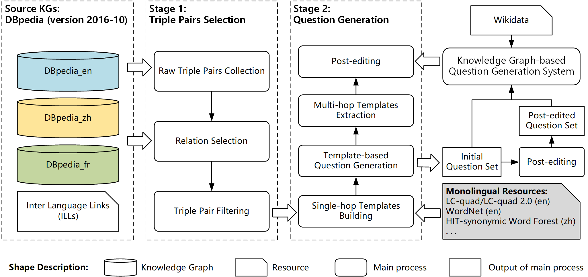

# MLPQ: A Dataset for Path Question Answering over Multilingual Knowledge Graphs

> Knowledge Graph-based Multilingual Question Answering (KG-MLQA), as one of the essential subtasks in Knowledge Graph-based Question Answering (KGQA), emphasizes that questions on the KGQA task can be expressed in different languages to solve the lexical gap between questions and knowledge graph(s). However, the existing KG-MLQA works mainly focus on the semantic parsing of multilingual questions but ignore the questions that require integrating information from cross-lingual knowledge graphs (CLKG). This paper extends KG-MLQA to Cross-lingual KG-based multilingual Question Answering (CLKGQA) and constructs the first CLKGQA dataset over multilingual DBpedia named MLPQ, which contains 300K questions in English, Chinese, and French. We further propose a novel KG sampling algorithm based on subgraph structural features and obtain KGs for MLPQ, making the evaluated methods compatible with our datasets. To evaluate the dataset, we put forward a general question answering framework whose core idea is to transform CLKGQA into KG-MLQA. We first use the Cross-lingual Entity Alignment (CLEA) model to merge CLKG into a single KG and get the answer to the question by the Multi-hop QA model combined with the Multilingual pre-training model. Then we establish two baselines for MLPQ, one of which uses Google translation to obtain alignment entities, and the other adopts the recent CLEA model. Experiments show that the simple combination of the existing QA and CLEA methods fails to obtain the ideal performances on CLKGQA. Moreover, the availability of our benchmark contributes to the community of question answering and entity alignment.

## Table of contents
  1. [Datasets](#datasets)
       1. [Overview](#overview)
       2. [Dataset creation](#dataset-creation)
       3. [Statistics](#statistics)
       4. [Use of the datasets](#use-of-the-datasets)
  2. [Baselines](#baselines)
  3. [Versions and future work](#versions-and-future-work)
       1. [Version 1.1 update](#version-11-update)
       2. [Current version](#current-version)
       3. [Future work](#future-work)
  4. [License](#license)

## Datasets

### Overview
There are a total of 300K questions in MLPQ, which covers three language pairs (**English-Chinese**, **English/French**, and **Chinese/French**), and requires a **2-hop** or **3-hop** cross-lingual path inference to answer each question.

### Dataset creation
We establish MLPQ through a semi-automatic process shown in the following picture:

### Statistics

The number of the selected triple pairs for question generation(2-hop and 3-hop), the number of entities covered in the selected triple pair, and the number of relation pairs covered in the selected triple pair:

| KG | 2-hop | 3-hop | Entity | Rel Pairs |
| --- | --- | --- | --- | --- |
| en-zh | 19k | 45k | 33k | 4.5k |
| en-fr | 22k | 68k | 54k | 8.7k |
| zh-fr | 10k | 35k | 23k | 2.8k |
 
The statistics of the generated questions, each subset contains English, Chinese, and French versions, with a total scale of 326,952 questions:

| KG    | 2-hop | 3-hop | 2-hop Relation Pairs | 3-hop Relation Pairs|
| ----- | ----- | ----- | -------------- | -------------- |
| en-zh | 10133 | 22414 | 1322           | 2853 |
| en-fr | 9979  | 37381 | 1195           | 6368 |
| zh-fr | 5604  | 24373 | 761            | 1719 |
| Sum   | 25716 | 84168 | 3278           | 10940 |

### Use of the datasets
- The datasets are available in two formats. One is in RDF format, the other is in a custom format similar to the datasets used in [IRN](https://github.com/zmtkeke/IRN/tree/master/PathQuestion).
- All the datasets are in the [datasets](./datasets) directory. For explanation of file naming convensions and our custom format, please refer to this directory for further information.

## Baselines
- We established 3 baseline models of MLPQ.
- The latest baseline combines [**NMN**](https://github.com/StephanieWyt/NMN) and [**UHop**](https://github.com/zychen423/UHop.git) on our latest dataset that have integrated bilingual KGs. It is the one that achieves highest scores on our datasets.
- The other 2 older models use [MTransE](https://github.com/muhaochen/MTransE-tf) and are tested on the 1.0 version of our datasets:
  - **MIRN** is based on the popular multi-hop reasoning model [IRN](https://github.com/zmtkeke/IRN/tree/master).
  - **CL-MKQA** is based on a [multiple KGQA model](https://dl.acm.org/doi/10.5555/3016100.3016335)
- Baseline codes are in the [baselines](baselines) directory. To try these baselines, please refer to this directory for further information.

## Versions and future work

### Version 1.2 update
Recreated the datasets to address the diversity problem and the redundancy problem in the datasets. As a result, we now have fewer questions. Also added a new baseline framework combining NMN and UHop with Bert.
### Version 1.1 update
In this slightly improved version, we corrected many grammatical errors and added the RDF version of all the datasets.

### Current version
- Currently the MLPQ version is `1.2`. We expect to further the work and provide datasets of higher quality and more variety in the future.
- Because the generation of MLPQ is semi-automatic and relies on manually crafted templates and machine translation to some degree, there might be some minor problems in the text. We try to improve the quality of MLPQ by post-editing and there should be very few problems now. However, if you find any errors in the dataset, please contact us, thanks.

### Future work
For now, MLPQ mainly contains 2-hop and 3-hop path questions. In the future, we plan to adopt retelling generation based on web resources to create a greater abundance of question expressions. The path question is merely one subset of complex questions; we also plan to update and augment factoriented complex questions with property information and to explore aggregate-typed complex questions.

## License
This project is licensed under the GPL3 License - see the [LICENSE](LICENSE.txt) file for details
